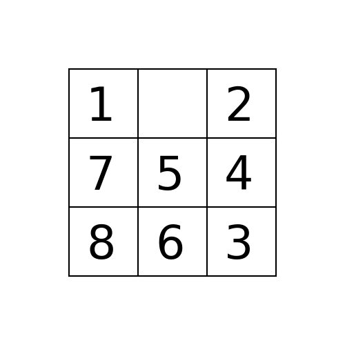

# Eight tile puzzle using cpp

 

# Rules 

  <ul>The 8-puzzle is a sliding puzzle that is played on a 3-by-3 grid</ul>
      with 8 square tiles labeled 1 through 8, plus a blank square. 
  <ul>The goal is to rearrange the tiles so that they are in row-major order, 
      using as few moves as possible.</ul>
  <ul>You are permitted to slide tiles either horizontally or  
      vertically into the blank square.</ul>

