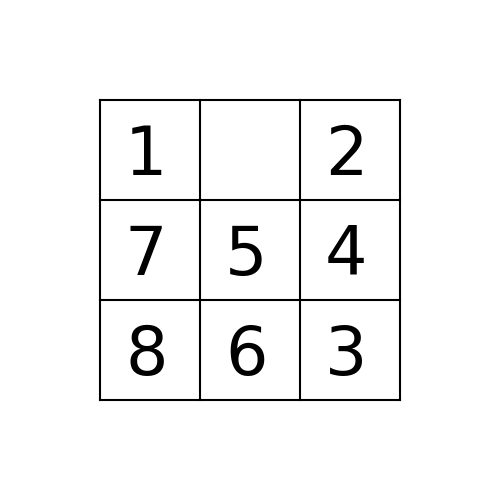

# Puzzle

 

=The 8-puzzle is a sliding puzzle 
=that is played on a 3-by-3 grid with 8 
=square tiles labeled 1 through 8, plus a 
blank square. The goal is to rearrange the 
tiles so that they are in row-major order, 
using as few moves as possible.

# Eight tile puzzle using cpp

# Rules

1.Empty space can move in four direction 
-Down - Left -Right -Up
 
2.The empty space cannot move diagonally and  
can only take one step at a time 

3.You are permitted to slide tiles either horizontally or  
vertically into the blank square.

